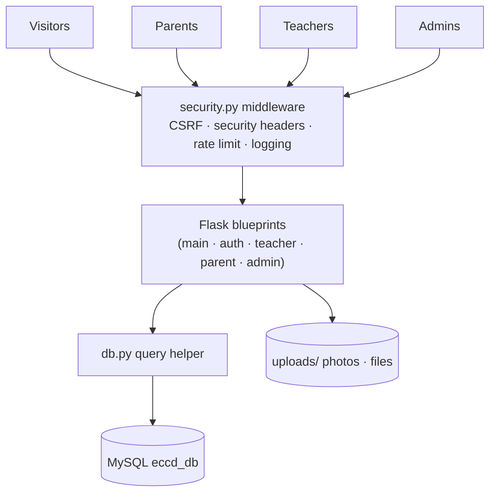

# Early Childhood Care and Development
(ECCD Monitoring System)

A complete, production-ready **Daycare / Early Childhood Education (ECCD) monitoring portal** for running an early-childhood learning center over the web. It gives **administrators**, **teachers**, and **parents** one clean, responsive system to run daily daycare operations: classrooms, enrollment, classwork & grading, attendance, health records, announcements, notifications, reports, analytics, and a fully editable public website.

Built with **Flask + MySQL**, styled for mobile and desktop, and hardened with CSRF protection, security headers, rate-limited admin login, and safe file handling.

> **Status note (latest vs. the old README):** an **Administrator portal** with its own login at `/admin` is now live. All teacher registrations require **admin approval** (no more auto-approve bootstrap). The LRN (Learner Reference Number) has been **fully removed** from the UI and database. Teacher **Stream posts now reach parents** (new "Classroom Stream" tab on the parent classroom page). Teacher & parent dashboards are full-width.
>
> **What's new in the current release:**
> - **Contact-form submissions are now emailed** — the public form still saves to `contact_inquiries` (Admin → Inquiries) **and** notifies the address shown in the **"Get in touch"** box (Admin → Website Settings), so a message is never only in the database. A mail failure never loses the inquiry.
> - **Registration reopens on the step that failed** — the 3-step teacher/parent wizards no longer throw you back to the first page when a field is rejected. The failing step reopens with a persistent error banner and the offending field highlighted, and your earlier answers are kept. Password / confirm-password is now also checked **in the browser**, so a mismatch is caught before the form is even submitted.
> - **Programs section has one CTA** — the "Explore Program" link is a single button under the cards instead of repeating on every card.
> - **Forgot Password is now emailed** — enter your registered email at `/forgot-password` and a single-use, 2-hour reset link is sent via SMTP (sender: *ECCD*), replacing the old security-question flow.
> - **Attendance calendar is now aware of school days** — teachers can mark a date as a **holiday / vacation / make-up day** per classroom, and the calendar follows each classroom's **weekly schedule** (which weekdays are school days + start/end times). Newly enrolled children are never auto-marked present.
> - **Classroom schedules are structured** — instead of a free-text "Schedule" box, teachers pick the **weekday(s)** and **start/end times**; the form feeds the attendance calendar.
> - **Subject folders are manageable** — teachers can **add / rename / delete** classwork subject folders per classroom (delete is blocked while a folder still has activities).
> - **Branded site icon & logo** — the system now ships your **logo as the browser favicon** and uses it across the admin sidebar, admin login, landing page, and navbar (see Admin → Website Settings to swap the landing logo).
> - **Admin Audit & Security page** — a dedicated admin tab with the system-wide **audit log** and a **security grading checklist** (CSRF, headers, passwords, rate limiting, S3/lcore…).

---

## Table of Contents

1. [Roles](./README.md#roles)
2. [Feature overview by portal](./README.md#feature-overview-by-portal)
3. [Public website](./README.md#public-website)
4. [Core workflows](./README.md#core-workflows)
5. [Data model](./README.md#data-model)
6. [Security](./README.md#security)
7. [Tech stack](./README.md#tech-stack)
8. [Getting started](./README.md#getting-started)
9. [Database migrations](./README.md#database-migrations)
10. [Configuration](./README.md#configuration-environment-variables)
11. [Production deployment](./README.md#production-deployment)
12. [Project structure](./README.md#project-structure)
13. [Diagrams & architecture](./docs/ARCHITECTURE.md)
14. [Quality & verification](./README.md#quality--verification)
15. [Roadmap](./README.md#roadmap)
16. [FAQ](./README.md#faq)
17. [License](./README.md#license)

---

## Roles

| Role | Signs in at | What they manage |
|------|-------------|------------------|
| **Admin** | `/admin` → `/admin/login` (dedicated dark portal, rate-limited) | System-wide: teachers & approvals, centers, all learners/classrooms, analytics, contact inquiries, the whole public website |
| **Teacher** | `/login` | Their classrooms, learners, classwork, grades, attendance, health records, announcements, reports |
| **Parent** | `/login` | Their child's profile, enrollment requests, class stream, classwork submissions & grades, attendance, notifications |
| **Visitor** | — | Public landing page + contact form; can register as teacher or parent |

Public `/login` **rejects administrator accounts** ("Administrator accounts must sign in through the Admin Portal") — admins only sign in through the dedicated admin portal.

---

## Feature overview by portal

### 🔐 Admin Portal (`/admin`)
- **Overview dashboard** — system-wide counts and activity.
- **Teachers & Approvals** — approve or reject pending teacher registrations; the account becomes active the moment it is approved.
- **Centers** — create and manage **Child Development Centers** (a center is the institution that operates classrooms).
- **All Learners / All Classrooms** — browse the whole directory across centers.
- **System Analytics** — aggregations across the installation.
- **Contact Inquiries** — read/delete submissions from the public contact form (every submission is also emailed to the address in the landing page's "Get in touch" box).
- **Website Settings** — full visual editor for the public landing page (see [Public website](#public-website)) plus a local image upload manager.
- **Audit & Security** — browsable system-wide **audit log** (role, actor, action, detail, IP, user-agent) plus a **security checklist** page that grades the deployment (CSRF, headers, password hashing, rate limiting, session hardening, etc.).

### 👩‍🏫 Teacher Portal
- **Dashboard** — real-time overview: active classrooms, enrolled learners, pending enrollment requests, outstanding grading, upcoming due work.
- **Classrooms** — create, draft, publish, archive, and activate classes; per-class banner, theme color, subject, age group, school year, **structured schedule (weekday checkboxes + start/end time)**, and max-learner cap.
- **Classroom workspace** (six tabs per classroom):
  - **Dashboard tab** — stats, upcoming deadlines, recent/ungraded submissions.
  - **Stream** — post announcements/reminders/materials/events/notices to the class feed with optional file attachments and **pin-to-top** support.
  - **Classwork** — organized in **manageable subject folders** (default: Mathematics, English, Mother Tongue, Filipino, Science, Drawing, Storytelling — folders can be **added, renamed, or deleted** per classroom). Create activities, assignments, worksheets, **graded assessments**, and reading materials with file attachments and due dates.
  - **Learners** — the class roster; assign/remove enrolled learners.
  - **Grades & Progress** — enter 0–100 scores + remarks per assessment for every enrolled learner in one form.
  - **Requests** — accept or reject parent enrollment requests.
- **Enrollment Requests** — central inbox of pending parent requests with accept/reject.
- **Attendance Calendar** — monthly calendar per classroom; mark each learner **Present / Absent / Tardy** per day with prev/next-month navigation, a day grid, and a month summary. The calendar follows the classroom's **weekly schedule** (school days) and honors per-date **overrides** (holidays / vacations / make-up days) set from the calendar's **Calendar Settings** panel; only learners enrolled on or before the marked date are recorded.
- **Health Records** — per learner: **BMI** (auto-computed from height/weight, classified by age via WHO BMI-for-age) and developmental **milestones**.
- **Learners Directory** — search all learners, age/gender filters, photos, contact info; add birth-certificate remarks.
- **Reports** — learner summaries, class reports, attendance summaries, progress snapshots (per-learner grade breakdown).
- **Predictive Analytics** — charts for age groups, gender, enrollment, attendance, and classwork completion.
- **Announcements** — publish school-wide notices (category + priority) that appear on the parent **Announcements** page.
- **Messages** — **1:1 threads with parents** (per teacher ↔ parent pair), with live polling so a chat window stays up to date without a page reload.
- **My Profile** — self-service editor for **profile picture, full name, position, username, email, mobile number and address**, plus a **change-password** form. Details an administrator verified at approval (**Employee ID, School / Center ID, Development Center, account status**) are shown read-only.

> **Two communication paths (important):**
> - **Classroom Stream** (`posts` table) — per-classroom feed; visible to parents on the classroom's **"Classroom Stream"** tab, and to the teacher under the classroom's **Stream** tab.
> - **Announcements** (`announcements` table) — school-wide notices; visible on the parent **Announcements** page (filtered by category) and manageable in the teacher **Announcements** page.
>
> Both now reach parents end-to-end (verified).

### 👨‍👩‍👧 Parent Portal
- **Dashboard** — child summary card (photo upload, relationship, center, enrolled classroom), plus live stat cards: **attendance rate** (computed from real records), **BMI status** (last record), and enrolled-classroom count.
- **Child Profile** — full developmental profile: photo, birth certificate upload + remarks, **BMI history**, **attendance history**, and **assessment/grades history** with parent-visible scores.
- **Find & Enroll** — browse active classrooms with teacher name, center filter, capacity, and current request status; request enrollment (or unenroll) directly.
- **Classroom page** — three tabs: **Classroom Stream** (teacher updates + pinned posts), **Classwork & Grades** (each item with its score/remarks or "Not Graded", plus attachment downloads), and **Attendance** (history per child).
- **Classwork submission** — open any classwork item, view the grade, and **submit / re-submit work** (text and/or file attachment).
- **Announcements** — notices posted by their child's teacher(s) only (never leaked to parents enrolled under other teachers or centers).
- **Schedule** — view the classroom program flow (daily schedule and special program-of-activities timelines) published by the teacher.
- **Notifications** — bell icon with unread badge; mark-as-read flow; auto **due-date reminders** ("due tomorrow") for unsubmitted classwork.
- **Messages** — **1:1 chat with your child's teacher** (per teacher ↔ parent pair), opened from the classroom page, with polled live updates.
- **Settings** — pick a theme color for their portal.
- **My Profile** — self-service editor for **profile picture, full name, username, email, mobile number and address**, plus a **change-password** form.

---

## Public website

- Fully editable landing page persisted in the `site_settings` table and edited from **Admin → Website Settings** (no code changes): school name, tagline, description, **color theming** (primary/secondary/accent/background/surface/text), contact info + social links, **hero** (eyebrow, heading, supporting text, CTAs, images), benefits, programs (3 age-staged cards — *Little Explorers / Bright Beginnings / Kindergarten Ready* out of the box; add, reorder, or remove them in Settings), daily schedule, activities, **gallery** (with categories + filter), and contact form.
- Templates are re-read from disk on every request (`TEMPLATES_AUTO_RELOAD = True`), so page edits appear **without a server restart**.
- **Local-uploads-only policy**: image URLs pointing to the internet are blanked for safety; images are uploaded through `uploads/website/` (gallery, media, avatars).
- Public **contact form** stores submissions in `contact_inquiries` (managed under Admin → Inquiries) **and emails a notification** to the address configured in the **"Get in touch"** box — so editing that address in Website Settings changes both what visitors see and where inquiries are delivered.

---

## Core workflows

**1. Teacher registration & approval**
Register as Educator → account is created with status `pending`. The form now **requires an ID submission**: the **ID number on the card** plus a **photo of the ID** (school / center / government ID; validated upload). The admin views the submitted ID under **Admin → Teachers & Approvals** (ID number shown, "View ID" opens the photo, with a download link) and can verify it before clicking **Approve/Reject** → on approval the teacher can log in. (Every teacher registration requires admin approval; there is no auto-approve bootstrap.)

**2. Parent registration**
Register as Parent → creates the parent account **and** the child profile (relationship, center, photo, birth certificate) in one atomic transaction. Parents can log in immediately.

> Both wizards are 3-step forms (Profile / Contact / Account). If a value is rejected, the form **reopens on the step that failed** — with a persistent error banner, the offending field highlighted, and your previous answers (including the address cascade) still filled in — instead of starting over at step 1.

**3. Enrollment**
Parent opens **Find & Enroll**, picks a classroom, and submits a request → teacher sees it in **Enrollment Requests** / the classroom **Requests** tab → **Accept** enrolls the child (written to `classroom_learners`), **Reject** records the rejection. Re-request reuses the same row (no duplicate keys), and already-pending requests are detected.

**4. Classwork & grading loop**
Teacher uploads classwork to a subject folder (parents of every enrolled child are notified) → parent sees it in the classroom **Classwork & Grades** tab, downloads the attachment, and submits work → teacher grades from the classwork's **Submissions** page (0–100 + remarks) → parent gets a **"Classwork Graded"** notification and sees the score everywhere (classroom page, child profile, item page).

**5. Attendance**
Teacher sets the classroom **weekly schedule** (which weekdays are school days + start/end time) at creation time, and marks Present/Absent/Tardy on the monthly **Attendance Calendar** → parents see the child's history in the classroom **Attendance** tab and the attendance-rate stat on their dashboard. When a date is **not a school day** the calendar shows it as such; holidays / vacations / make-up days are managed from the calendar's **Calendar Settings** panel. Newly enrolled children are only marked on/after their enrollment date.

**6. Classroom Stream**
Teacher posts to the classroom **Stream** (optional pin, optional file) → parents see it on the classroom **"Classroom Stream"** tab, pinned posts first.

**7. Forgot password**
From `/forgot-password` (linked on the login page and the admin login), a user enters their **registered email**. If the account exists, the system emails a **single-use reset link** (valid 2 hours) whose token is stored **hashed** in `password_resets`. Clicking the link leads to a new-password form; once set, the token is invalidated and the user can log in. The response is identical whether or not the email exists (no account enumeration), and the flow is **rate-limited** per IP.

**8. Messaging**
A teacher opens a **1:1 thread** with a parent from the parent's classroom; both sides chat in the **Messages** page, which polls for new messages so conversations appear in near real time.

---

## Data model

MySQL/MariaDB schema in `schema.sql` (idempotent — `CREATE TABLE IF NOT EXISTS`), plus incremental tables created by `migrations/`. 30 tables:

| Table | Purpose |
|-------|---------|
| `centers` | Child Development Centers (institution the classrooms run under) |
| `users` | Login accounts (`role` ∈ teacher / parent / admin) |
| `teachers` | Teacher profiles, credentials + `status` (pending/active/rejected) |
| `parents` | Parent profiles + profile photo + theme |
| `learners` | Child profiles bound to a parent + center |
| `classrooms` | Classes; status ∈ active / archived / draft; max-learner cap |
| `classroom_learners` | Enrollment join table (classroom ↔ learner, unique pair) |
| `posts` | Classroom **Stream** posts (type, title, content, file, pinned) |
| `classwork` | Classwork items in subject folders; type ∈ activity/assignment/worksheet/assessment/material |
| `classwork_submissions` | Parent submissions per (classwork, learner) |
| `assessments` | Grades (score 0–100, remarks) per (learner, classwork) |
| `attendance` | Daily present/absent/tardy per (learner, classroom, date) |
| `school_days` | Per-classroom **date overrides** (holiday / vacation / make-up day) for the attendance calendar |
| `bmi_records` | Height/weight/BMI + status history (now includes age at time of record) |
| `milestone_records` | Developmental milestone logs |
| `announcements` | School-wide notices (category + priority) |
| `enrollment_requests` | Pending/accepted/rejected requests (unique per classroom+learner) |
| `classroom_schedules` | Classroom program flow (daily routine + special program-of-activities) |
| `notifications` | Per-user in-app notifications with link and read flag |
| `messages` | Teacher ↔ parent **1:1 messaging** threads |
| `learning_activities` | Learning activity plans per classroom |
| `award_categories` / `awards` | Award types and per-learner awards |
| `gallery_photos`, `news` | Landing-page gallery photos and public news items |
| `site_settings` | Editable public-website configuration (JSON) |
| `contact_inquiries` | Public contact-form submissions |
| `audit_logs` | Append-only security/activity trail shown to admins |
| `subject_folders` | Per-classroom classwork folders (add / rename / delete) |
| `password_resets` | Hashed, single-use emailed reset tokens with expiry |

Related rows are protected with referential integrity (`ON DELETE CASCADE` / `SET NULL`), and every important table has `CHECK` constraints on its allowed status values. **No LRN column is used** — the legacy `learner_id` LRN concept was removed from the UI and the production database; only internal FK columns named `learner_id` remain (do not confuse the two).

---

## Security

- **CSRF protection** on every state-changing form (`security.py`).
- **Security headers**: Content-Security-Policy, `X-Frame-Options: DENY`, `nosniff`, `Referrer-Policy`, legacy XSS header.
- **Upload hardening**: extension whitelist **plus** magic-byte signature validation (PNG/JPG/GIF/PDF) and a 16 MB cap; user uploads are served with `no-cache`.
- **Passwords hashed** with Werkzeug (`generate_password_hash`); registration security answers are hashed too.
- **Session cookie hardening**: HttpOnly, `SameSite=Lax`, optional `Secure`.
- **Rate-limited admin login** (`security.py:rate_limit`) — per-IP, per-account throttling on the admin portal; the forgot-password and public contact-form flows are rate-limited the same way.
- **Contact-form injection hardening** — submissions are stored first, then emailed with every value HTML-escaped exactly once (`Markup.format`) and CR/LF stripped from the subject, so a crafted name cannot inject headers or markup.
- **Object-level ownership checks** — a teacher can only manage their own classrooms/learners; parents only see their own child's data; admin pages are admin-only.
- **Self-service profile editing is owner-scoped** — a teacher or parent may only edit their *own* record; the admin-verified fields (Employee ID, School/Center ID, Development Center, account status) are read-only in the UI and never written by the profile routes. Profile pictures re-run the full extension + magic-byte check and are capped at 5 MB.
- **Password change requires the current password**, enforces the same strength rules as registration, and **deletes any outstanding forgot-password token** so an old reset link cannot be reused afterwards.
- **Role-separated login** — public `/login` rejects admins; administrators sign in at `/admin/login`.
- **Append-only audit log** — every important action (logins, approvals, enrollment, attendance, classwork, calendar, password resets, security events) writes to `audit_logs`; admins browse it under **Admin → Audit & Security**.
- **Password reset hardening** — reset tokens are **random, stored hashed (SHA-256), single-use, and expire** in 2 hours; the request endpoint answers identically for existing and unknown emails (no user enumeration).
- **Request logging** to a rotating `app.log` (query strings intentionally omitted — they can carry PII).

---

## Tech stack

| Layer | Technology |
|-------|-----------|
| Backend | Python 3.10+, Flask 3 |
| Database | MySQL / MariaDB 10.4+ (`utf8mb4`) |
| Web server | Flask dev server (LAN) or **Waitress** (production) |
| Frontend | Bootstrap 5 + Bootstrap Icons, vanilla JS, Chart.js, Bootstrap-datepicker |
| Fonts | Google Fonts (Quicksand) |

---

## Getting started

### 1. Prerequisites
- Python 3.10+
- MySQL or MariaDB running locally (or reachable)
- `pip`

### 2. Install dependencies
```bash
pip install -r requirements.txt
```

### 3. Create the database (migrations)

```bash
py migrate.py --demo  # one command: create DB + run migrations + load demo data
```

`migrate.py` creates `eccd_db` (if missing), applies the canonical baseline schema (`schema.sql`) plus any pending files in `migrations/` in **filename order**, records each applied migration in the `schema_migrations` table, and bootstraps the default administrator. No default Child Development Center is seeded — a center is created only when the first teacher registers one.

Alternatives:
- `py init_db.py` — the original one-shot initializer (creates DB + loads `schema.sql` + admin). Retained for compatibility; `migrate.py` supersedes it.
- `py migrate.py --demo` — **full fresh-PC build in one command** (schema + demo dataset). Recommended for setting up on another machine.
- `py migrate.py --fresh --demo` — clean slate followed by demo data.

### 4. Run the app

**Development / LAN:**


```bash
pip install -r requirements.txt    # 1. install dependencies (one time)
py migrate.py                      # 2. create the database + tables + admin (one time)
py seed_demo.py                    # 3. optional: demo data (teacher + parents)
py run.py                          # 4. start the server

$env:SERVE_WITH = "waitress"
$env:SECRET_KEY = "some-random-long-string"
py run.py
```
Outbound email (forgot-password reset links **and** public contact-form notifications) uses the SMTP settings from `config.py` (defaults: Gmail, `587`, STARTTLS). The sender app password is read from **`mail_secret.py`**, which is **git-ignored** — create it locally once:
```powershell
# mail_secret.py
MAIL_APP_PASSWORD = "your-smtp-app-password"
```
Or supply `MAIL_USERNAME` / `MAIL_PASSWORD` as environment variables instead.
Visit `http://127.0.0.1:5000/`. Other devices on your network can use `http://<your-ip>:5000/`.

**Debug mode** (hot reload):
```powershell
$env:FLASK_DEBUG = "1"
py run.py
```

### 5. First login / bootstrap
1. Open `http://127.0.0.1:5000/`. The default admin is `admin` / `Admin123!` (change it right away, or override via env vars — see below). Sign in at `/admin` with that account.
2. Under **Admin → Teachers & Approvals**, approve the teachers you want.
3. Teachers register at `/register/teacher` (status `pending`) and, once approved, create classrooms under their **Classrooms** page.
4. Parents register at `/register/parent` (account + child profile), then request enrollment in a classroom from **Find & Enroll**. The teacher accepts the request, and the child is enrolled.

> ⚠️ **Immediately change the default admin password** after first login (no in-app admin password change UI shipped yet — reset it via a SQL update or re-seed with a custom `ADMIN_PASSWORD`).

---

## Database migrations

The project uses a lightweight **versioned migration system** so that any machine can build (and keep in sync with) the exact same database.

| Piece | Purpose |
|-------|---------|
| `schema.sql` | **Canonical baseline schema** — the single source of truth for the current structure (30 tables). Applied as migration `0001_baseline_schema`. |
| `migrations/*.sql` | **Incremental migrations**, applied in filename order after the baseline. Currently shipped through **`0013_parent_profile_photo`** (teacher ID verification → content & messaging → learning/awards → classroom schedules → BMI age → immunization cleanup → audit logs → school days → classroom schedule fields → subject folders → password resets → parent profile photo). |
| `migrate.py` | The runner — creates the DB, applies every pending migration exactly once, and records each in the `schema_migrations` table. |
| `schema_migrations` | Tracking table (`version` PK + `applied_at`) created automatically by the runner. |
| `seed_demo.py` | Optional demo dataset (mirrors the reference/populated database). |

### Commands

```bash
py migrate.py          # create DB if missing + apply pending migrations + base seeds (admin)
py migrate.py --fresh  # DROP the database and rebuild from scratch (asks for confirmation)
py seed_demo.py        # optional: load the demo dataset (safe to skip)
```

### Adding a new migration

1. Create `migrations/0014_your_change.sql` with `CREATE`/`ALTER` statements (prefer `IF EXISTS` / `IF NOT EXISTS` guards so it is re-runnable).
2. Run `py migrate.py` on each environment — the runner applies only the new file and records it.

Because MySQL DDL commits implicitly, migrations are recorded **only after all their statements succeed**; every migration is written to be re-runnable, so a partial failure is fixed and simply re-run. `--fresh` needs a DB user with `DROP DATABASE` privilege (the default `root` has it).

---

## Configuration (environment variables)

All settings live in `config.py` and can be overridden with environment variables — **no code changes required**.

| Variable | Default | Purpose |
|----------|---------|---------|
| `DB_HOST` | `127.0.0.1` | MySQL host |
| `DB_PORT` | `3306` | MySQL port (Aiven/cloud MySQL uses a custom port) |
| `DB_USER` | `root` | MySQL user |
| `DB_PASSWORD` | *(empty)* | MySQL password |
| `DB_NAME` | `eccd_db` | Database name |
| `HOST` | `127.0.0.1` | Bind address (`0.0.0.0` for LAN/container) |
| `PORT` | `5000` | Bind port |
| `SECRET_KEY` | dev default* | Sessions/CSRF signing — **REQUIRED in production** |
| `SERVE_WITH` | `werkzeug` | `waitress` for the production server |
| `SESSION_COOKIE_SECURE` | `0` | Set `1` behind HTTPS |
| `FLASK_DEBUG` | `0` | `1` enables Flask debug mode |
| `ADMIN_USERNAME` | `admin` | Default admin username (bootstrap) |
| `ADMIN_PASSWORD` | `Admin123!` | Default admin password (bootstrap) |
| `ADMIN_EMAIL` | `admin@eccd.local` | Default admin email (bootstrap) |
| `MAIL_SERVER` | `smtp.gmail.com` | SMTP host used for forgot-password emails |
| `MAIL_PORT` | `587` | SMTP port (STARTTLS) |
| `MAIL_USERNAME` | `irishmaetorres10@gmail.com` | SMTP sender address |
| `MAIL_PASSWORD` | *(from `mail_secret.py`)* | SMTP app password — **kept out of git** in `mail_secret.py`; override via env if preferred |
| `MAIL_FROM_NAME` | `ECCD` | Display name shown as the email sender |
| `MAIL_DRY_RUN` | `0` | Set `1` to skip real SMTP sends (test/local mode): the reset link is flashed on the page instead, and contact-form notifications are logged only |
| `R2_ACCOUNT_ID` | *(empty)* | Cloudflare R2 account ID — set with the keys below to enable R2 object storage |
| `R2_ACCESS_KEY` | *(empty)* | R2 API access key ID (S3-compatible) |
| `R2_SECRET_KEY` | *(empty)* | R2 API secret access key |
| `R2_BUCKET` | *(empty)* | R2 bucket name |

Uploads behave differently depending on the storage backend:

- **Local disk (default):** files are written to `uploads/` under the project directory. This is fine for development, but **Render free instances wipe the filesystem on every deploy/restart**, so uploaded images disappear after each deploy.
- **Cloudflare R2 (production):** when **all four `R2_*` variables are set**, uploads are stored in your R2 bucket instead, so they survive deploys and restarts. Files are served through the existing `/static/uploads/...` URL by proxying from R2 — no code or template changes needed. On startup the app auto-syncs bundled files (e.g. the default logo) into the bucket.

> \* When `SERVE_WITH=waitress`, startup **fails fast** if `SECRET_KEY` is not set — this forces a secure key in production.

---

## Production deployment

### Waitress (Windows / Linux, no extra infra)
```powershell
$env:SECRET_KEY = "<long-random-secret>"
$env:SERVE_WITH  = "waitress"
$env:HOST        = "0.0.0.0"
$env:PORT        = "8000"
py run.py
```
The site is now served at `http://<server-ip>:8000/`.

### Recommended production stack
- **Reverse proxy** (Nginx / IIS / Caddy) in front of Waitress to provide **HTTPS**.
- Set `SESSION_COOKIE_SECURE=1` when HTTPS is enabled.
- Point `HOST=0.0.0.0` and forward port `8000` on the router if parents log in from outside the LAN.
- Keep `uploads/` and `app.log` backed up; back up the `eccd_db` database nightly (e.g., `mysqldump`).
- Run as a Windows Service or systemd unit so it restarts automatically.

### Ready-to-run example (Windows Task Scheduler / service)
```bat
@echo off
set SECRET_KEY=change-me-to-a-long-random-string
set SERVE_WITH=waitress
set HOST=0.0.0.0
set PORT=8000
cd /d D:\ECCD-main\ECCD-main
py run.py
```

---

## Project structure

```
D:\ECCD-main\ECCD-main\
├── run.py               # App factory + server entrypoint (werkzeug / waitress)
├── config.py            # Central configuration (env-driven; incl. SMTP mail settings)
├── db.py                # MySQL helper (queries + transactions)
├── security.py          # CSRF, security headers, rate limit, file signatures, input validators
├── mailer.py            # SMTP email sender (password-reset links + contact-form notifications)
├── mail_secret.py       # Git-ignored local SMTP app password (never committed)
├── profile.py           # Shared "My Profile" logic (photo storage, account fields, password change)
├── site_config.py       # Editable landing-page configuration (JSON in DB)
├── centers.py           # Child Development Center helpers + seeding
├── seed_data.py         # Default-admin bootstrap (ADMIN_* env vars)
├── init_db.py           # One-shot DB initializer (legacy; superseded by migrate.py)
├── migrate.py           # Versioned migration runner (creates DB, applies & records migrations)
├── seed_data.py         # Default-admin bootstrap (ADMIN_* env vars)
├── seed_demo.py         # Optional demo dataset (teacher + Nursery A + parent1..parent10)
├── schema.sql           # Canonical baseline schema (single source of truth)
├── sync_schema.py       # Legacy schema-upgrade helper
├── migrations/          # Incremental migrations (0002–0013), applied by migrate.py
│   └── README.md
├── requirements.txt     # Python dependencies
├── routes/
│   ├── main.py          # Public landing page + contact form
│   ├── auth.py          # Login, logout, registrations, email forgot-password
│   ├── teacher.py       # Full teacher portal (classrooms, classwork,
│   │                    #   attendance school calendar, grades, health, reports)
│   ├── parent.py        # Full parent portal (child profile, enroll,
│   │                    #   classwork submissions, notifications)
│   ├── messaging.py     # Teacher ↔ parent 1:1 messaging threads
│   └── admin.py         # Admin portal (approvals, centers, learners,
│                        #   analytics, inquiries, website settings, audit log)
├── templates/           # Jinja2 templates
│   ├── base.html        # Base shell + full-width block hook
│   ├── dashboard_base.html  # Responsive dashboard shell (sidebar + mobile bar)
│   ├── landing.html, login.html, register_*.html, error.html
│   ├── admin/           # Admin portal templates
│   ├── teacher/         # Teacher portal templates
│   └── parent/          # Parent portal templates
├── static/              # CSS, JS, bootstrap assets
├── uploads/             # User-uploaded files (local-only; Cloudflare R2 when configured)
│   ├── teachers/  learners/  certificates/
│   ├── classrooms/       # Class banners / landing images
│   ├── posts/  classwork/  submissions/
│   └── website/          # gallery / media / avatars for the landing page
└── *.sql                # Legacy DB dumps (not used at runtime; schema.sql is canonical)
```

---

## Diagrams & architecture

The full set of Mermaid diagrams lives in **[docs/ARCHITECTURE.md](./docs/ARCHITECTURE.md)** (renders natively on GitHub):

- [High-level system architecture](./docs/ARCHITECTURE.md#1-high-level-system-architecture) — Flask blueprints, security middleware, DB helper, uploads.
- [Deployment architecture](./docs/ARCHITECTURE.md#2-deployment-architecture) — reverse proxy → Waitress → Flask → MySQL.
- [Request lifecycle & security pipeline](./docs/ARCHITECTURE.md#3-request-lifecycle--security-pipeline) — CSRF, auth, role & ownership checks, headers, logging.
- [Business workflow flowcharts](./docs/ARCHITECTURE.md#4-business-workflows) — login routing · teacher registration & admin approval · parent registration · enrollment · classwork & grading loop · attendance · classroom stream · announcements · forgot-password · notifications.
- [Entity-relationship diagram](./docs/ARCHITECTURE.md#5-data-model-entity-relationship) — the 30-table data model.

### System at a glance



---

## Quality & verification

The system has been exercised end-to-end with automated smoke tests (Flask test client + live DB) across all four roles. Verified flows include:

- **Admin**: login portal, dashboard, teacher approvals, centers, learners/classrooms lists, analytics, inquiries, website settings, **audit-log & security checklist pages**.
- **Teacher**: dashboard, class CRUD + status transitions, classroom workspace (Stream / Classwork / Learners / Grades & Progress / Requests), **attendance calendar (mark + persist + month nav + school-day overrides + schedule-driven class days)**, **subject-folder create/rename/delete with empty-only deletion**, health/BMI recording, reports, analytics, announcements, classwork grading (inline + bulk).
- **Parent**: dashboard, child profile (photo/birth-cert upload, BMI/attendance/grades history), enrollment request → teacher accept → enrolled, classwork submission loop, **Classroom Stream now visible to parents**, announcements, notifications (unread badge, mark-as-read, due reminders, graded alerts, new-classwork alerts), **My Profile editor** (photo/name/username/email/mobile/address + change password; admin-verified teacher fields stay read-only, spoofed or oversized images rejected, cross-role access blocked, missing CSRF rejected).
- **Auth / forgot-password**: **email reset flow end-to-end** — request link (dry-run), open it, set a new password, old password rejected after reset, used token rejected, request recorded in the audit log.
- **Public registration UX**: teacher and parent wizards re-render **on the step the server rejected** (credentials / contact / profile), with the offending field marked and previously entered answers preserved.
- **Public contact form**: submission stored, notification rendered with values escaped exactly once and a subject free of injected headers.
- **Security**: role-separated logins (public login rejects admins), admin-only routes lockdown, anon redirects, invalid-score rejection, learner enrollment boundary checks.

All test data is cleaned up after runs; the shipped database seeds only the bootstrap admin plus demo classrooms/learners if you use `seed.py`.

---

## Roadmap

### 🔹 Before going fully public
- [ ] **Change the default admin password / add a password-change UI** for the admin account.
- [ ] **Email/SMS notifications** for approved/rejected enrollments, new announcements, and grades (password-reset and contact-form emails are already wired via SMTP).
- [ ] **PDF / Excel export** of learner reports, report cards, and attendance summaries.
- [ ] **HTTPS + reverse proxy** (Nginx/IIS/Caddy) + `SESSION_COOKIE_SECURE=1`.
- [ ] **Scheduled backups** — nightly `mysqldump` of `eccd_db` + copy of `uploads/`.

### 🚀 Nice-to-have (v2)
- [ ] Photo gallery **moderation queue** and public news feed on the landing page.
- [ ] **Multi-center** analytics roll-up (dashboard already shows per-center data).
- [ ] Milestone/development-checklist tracking with due-date reminders.
- [ ] Restore **print-friendly / PDF** report cards.

---

## FAQ

**Who signs in where?**
Teachers and parents use the public `/login`. Administrators sign in on the **Admin Portal** at `/admin` (public `/login` rejects admin accounts). All other pages are role-protected server-side.

**Does the system ask for an LRN?**
No. Philippine LRNs apply to DepEd grade levels, not daycare, so the portal no longer asks for one at registration, and the LRN column has been removed from the UI and the production database.

**How do parents see teacher announcements vs. the class stream?**
*Announcements* (the megaphone page) show school-wide notices published by teachers. *Classroom Stream* posts live inside each classroom and appear on the parent's classroom **"Classroom Stream"** tab (pinned posts first). Both are now delivered to parents.

**How do grades reach parents?**
When a teacher saves a score, parents see it on the classroom **Classwork & Grades** tab, the **Child Profile**, and the classwork item page — and receive a "Classwork Graded" notification linking straight to it.

**Can I edit the public website without touching code?**
Yes. Sign in as **admin** → **Website Settings**, then update text, colors, images, programs, and gallery. Templates re-read from disk, so saving is enough.

**Does the contact form send me an email?**
Yes. Every submission is saved to `contact_inquiries` (viewable at **Admin → Inquiries**) *and* emailed to the address in the **"Get in touch"** box. Change that address under **Admin → Website Settings** and the box and the delivery target update together. If SMTP is down the inquiry is still saved — nothing is lost, you just won't get the notification until the server is fixed. Set `MAIL_DRY_RUN=1` to suppress real sends while testing.

**Why are remote image URLs blanked?**
`site_config.py` enforces a **local-uploads-only** policy so the site can't leak users' IPs or depend on hotlinked third-party images.

**How is attendance tracked?**
Teachers use the monthly **Attendance Calendar** per classroom (Present/Absent/Tardy). Parents see per-day history and a live attendance-rate stat computed from real records.

**I forgot my password.**
Use **Forgot Password** (`/forgot-password`, also linked from the admin login) — enter your **registered email** and a single-use reset link is emailed to you (valid **2 hours**). Click the link, set a new password, and sign in. The flow is rate-limited and does not reveal whether an email exists. Requires the account's email on file to be real (teachers/parents) and the SMTP sender configured via `MAIL_*` (the app password lives in git-ignored `mail_secret.py`).

---

## License
For internal daycare-center use. Free to deploy and use for your school.
