# ECCD Monitoring System — Architecture & Flowcharts

Visual reference for how the **Little Dreamers ECCD portal** is built and how each workflow behaves. Diagrams are [Mermaid](https://mermaid.js.org/) and render natively on GitHub and most Markdown viewers.

- **Roles:** Admin · Teacher · Parent · Visitor
- **Stack:** Flask 3 + MySQL/MariaDB + Bootstrap 5 (see README → Tech stack)
- **Portals:** Public website (`/`), Teacher/Parent login (`/login`), Admin portal (`/admin`)

## Table of contents

1. [High-level system architecture](#1-high-level-system-architecture)
2. [Deployment architecture](#2-deployment-architecture)
3. [Request lifecycle & security pipeline](#3-request-lifecycle--security-pipeline)
4. [Business workflows](#4-business-workflows)
   - [4.1 Login & session routing](#41-login--session-routing)
   - [4.2 Teacher registration & admin approval](#42-teacher-registration--admin-approval-gated-by-admin)
   - [4.3 Parent registration](#43-parent-registration)
   - [4.4 Enrollment request](#44-enrollment-request)
   - [4.5 Classwork & grading loop](#45-classwork--grading-loop)
   - [4.6 Attendance recording](#46-attendance-recording)
   - [4.7 Classroom Stream (posts)](#47-classroom-stream-posts)
   - [4.8 Announcements](#48-announcements)
   - [4.9 Forgot / recover password](#49-forgot--recover-password)
   - [4.10 Notifications](#410-notifications)
5. [Data model (entity-relationship)](#5-data-model-entity-relationship)

---

## 1. High-level system architecture

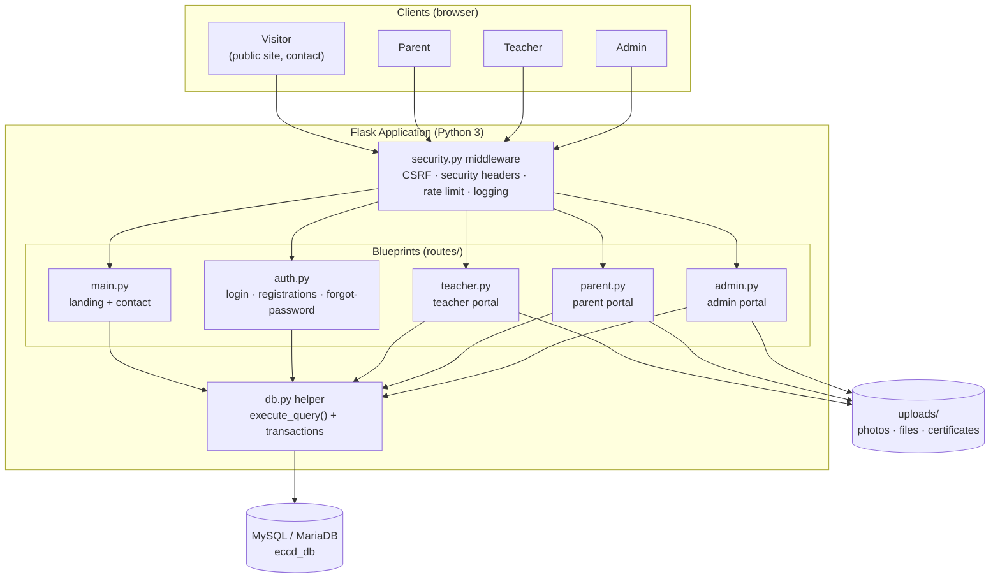

- Every request passes through `security.py`: **CSRF** validation on state-changing POSTs, **security headers** on every response, **rate limiting** on the admin login, and **request logging** (query strings omitted to protect PII).
- All five blueprints share one `db.py` query helper, which owns the single MySQL connection pool / transaction handling.
- Uploaded files (teacher photos, parent photos, learner photos, birth certificates, class banners, stream attachments, classwork submissions, website media) live under `uploads/` and are validated by extension **and** magic-byte signature, capped at 16 MB (5 MB for profile pictures, which go through the shared `profile.py` helpers).
- The self-service **My Profile** module (`profile.py` + the `teacher`/`parent` blueprints) lets an account edit only its own row: personal fields plus `users.username`/`users.email`, and a password change that requires the current password and invalidates outstanding reset tokens.

---

## 2. Deployment architecture

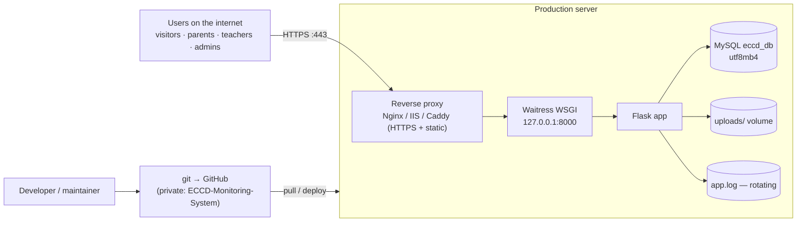

- Development uses the Flask dev server (`py run.py`); production runs **Waitress** behind a reverse proxy that terminates HTTPS.
- `init_db.py` creates the DB from `schema.sql` (idempotent) and bootstraps the default admin. The private GitHub repo is the single source of truth for code; the live MySQL DB and `uploads/` stay server-local (never committed — see `.gitignore`).

---

## 3. Request lifecycle & security pipeline

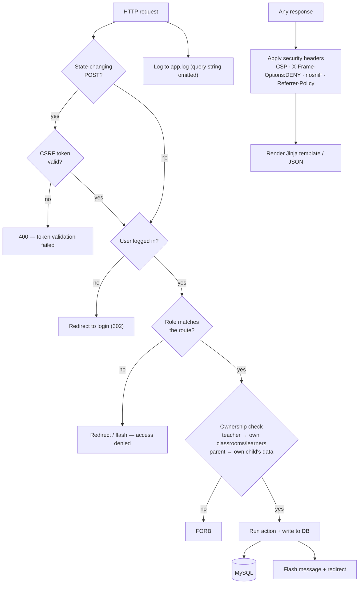

---

## 4. Business workflows

### 4.1 Login & session routing

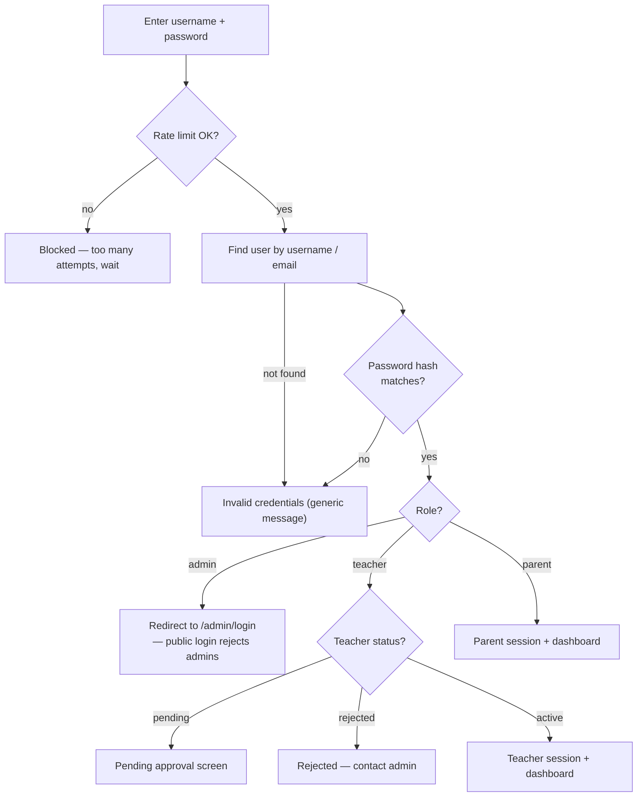

- Public `/login` **rejects administrator accounts** deliberately; admins sign in only through the dedicated admin portal.

### 4.2 Teacher registration & admin approval (gated by admin)

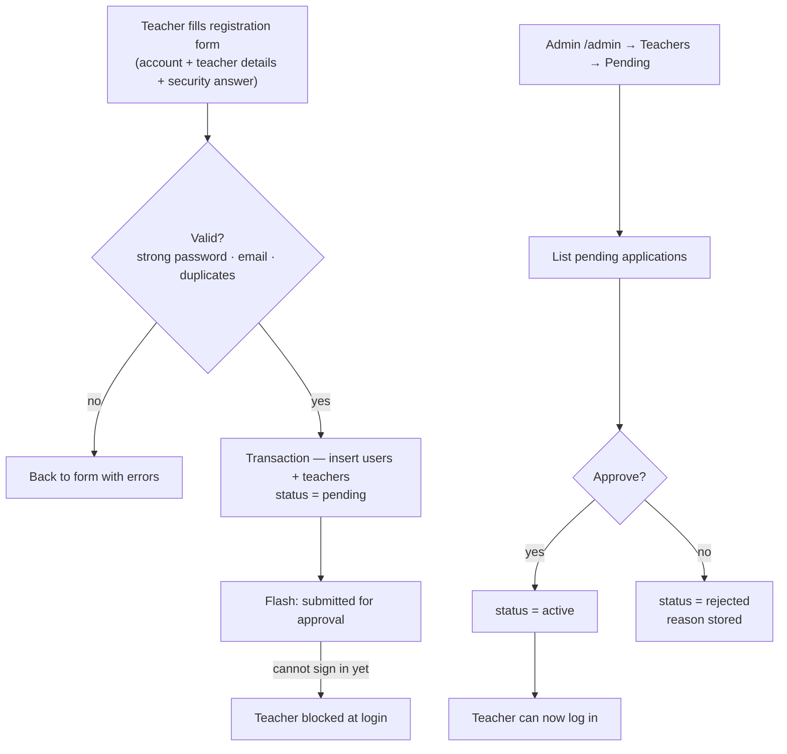

### 4.3 Parent registration

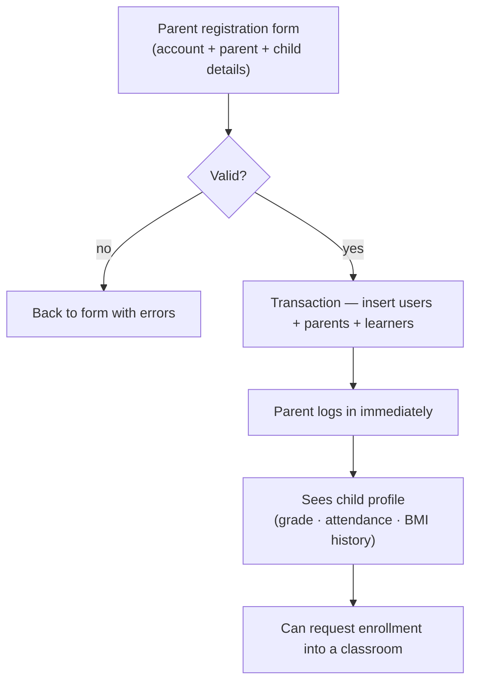

### 4.4 Enrollment request

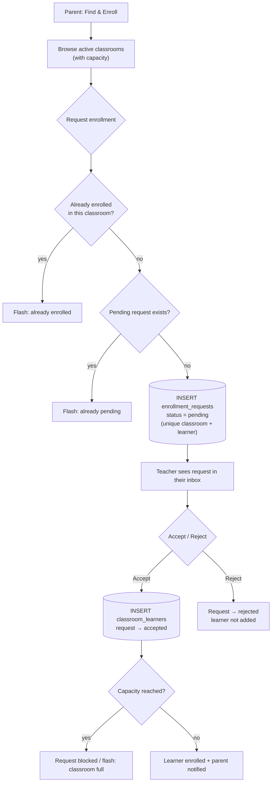

### 4.5 Classwork & grading loop

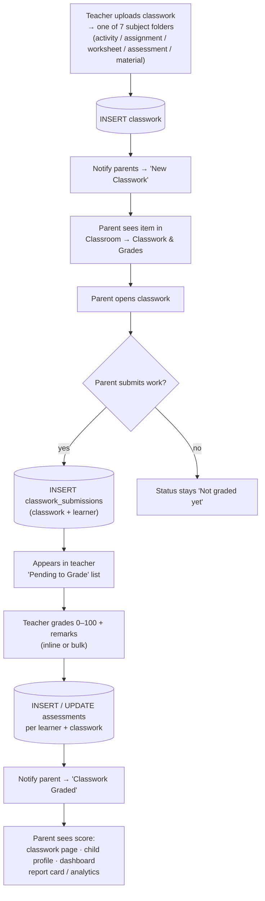

### 4.6 Attendance recording

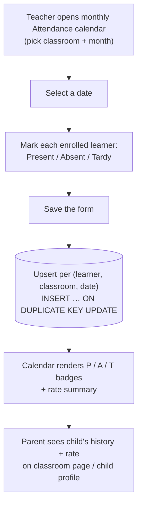

### 4.7 Classroom Stream (posts)

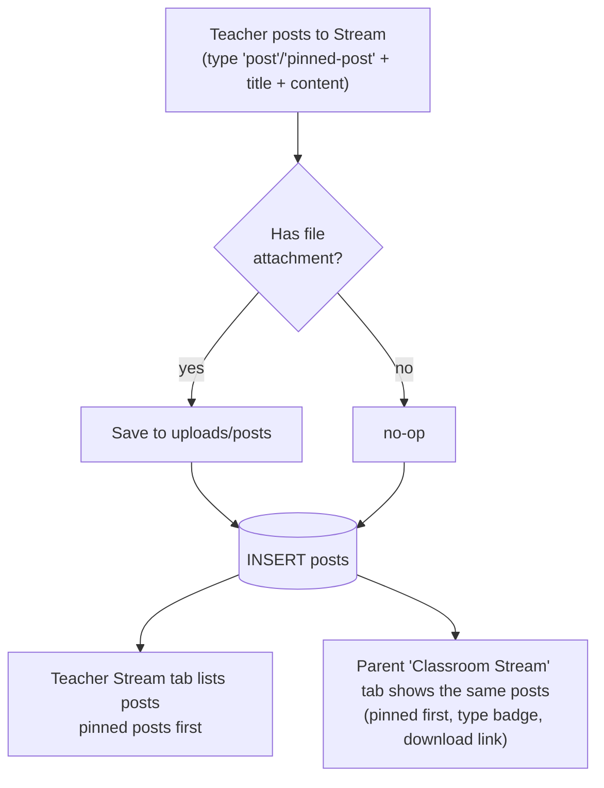

### 4.8 Announcements

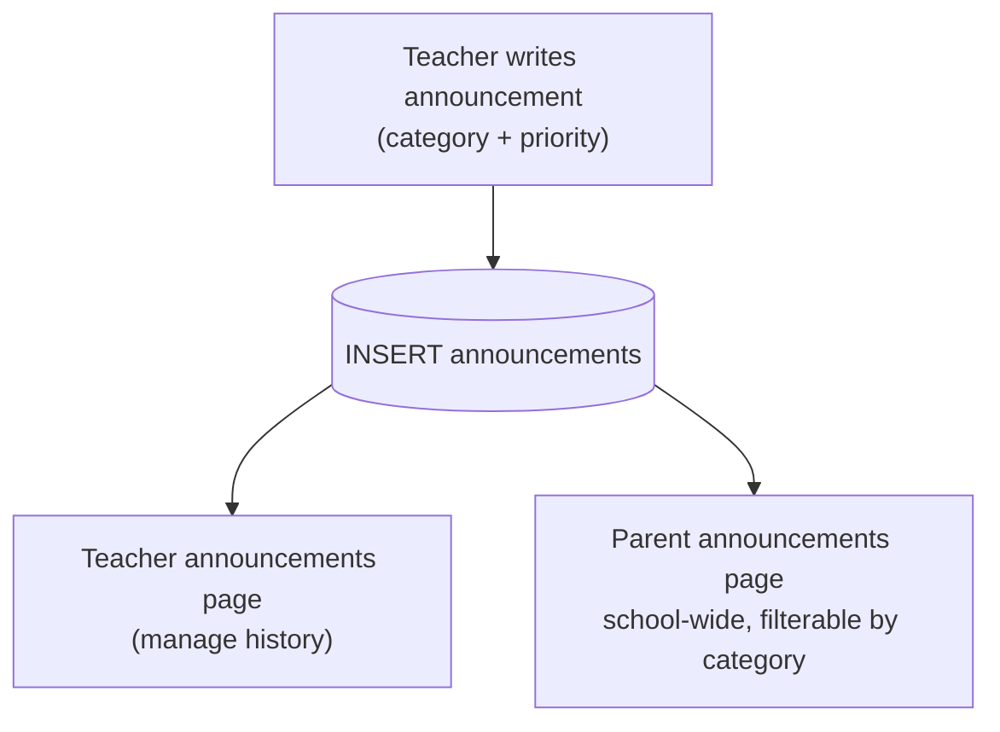

### 4.9 Forgot / recover password

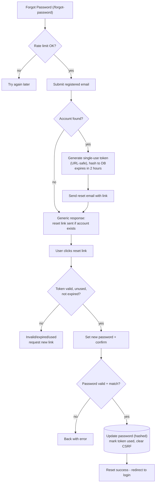

### 4.10 Notifications

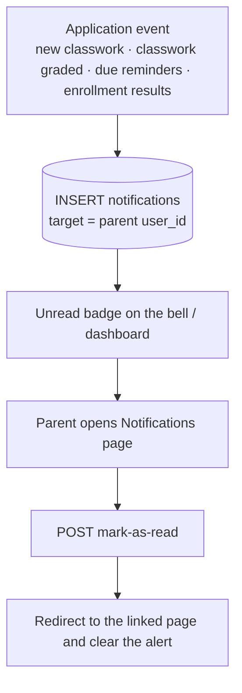

---

## 5. Data model (entity-relationship)

Complete schema: [`schema.sql`](../schema.sql) (19 tables). Key entities and their relationships:

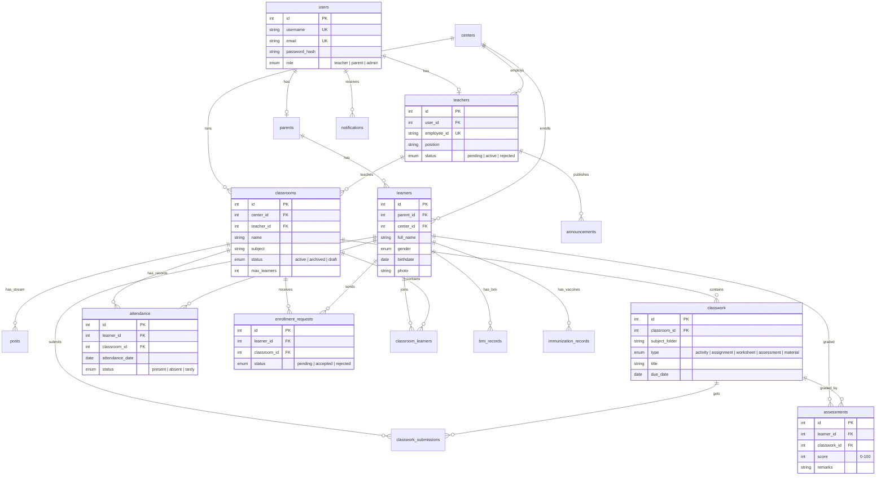

Notes:

- Every important table uses `CHECK` constraints on allowed status/type values, and referential integrity (`ON DELETE CASCADE` / `SET NULL`).
- `classroom_learners` is a join table with a **unique (classroom_id, learner_id)** pair — one learner per classroom.
- **No LRN (Learner Reference Number)** is in use — the legacy LRN column was removed from the UI and the production DB; only internal FK columns named `learner_id` remain.
- `immunization_records` is schema-reserved (no UI yet).